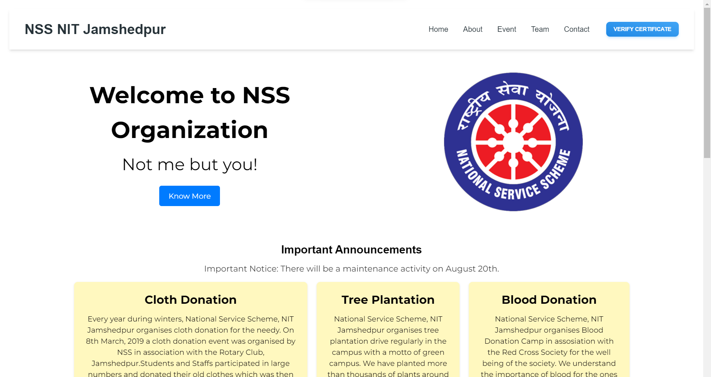
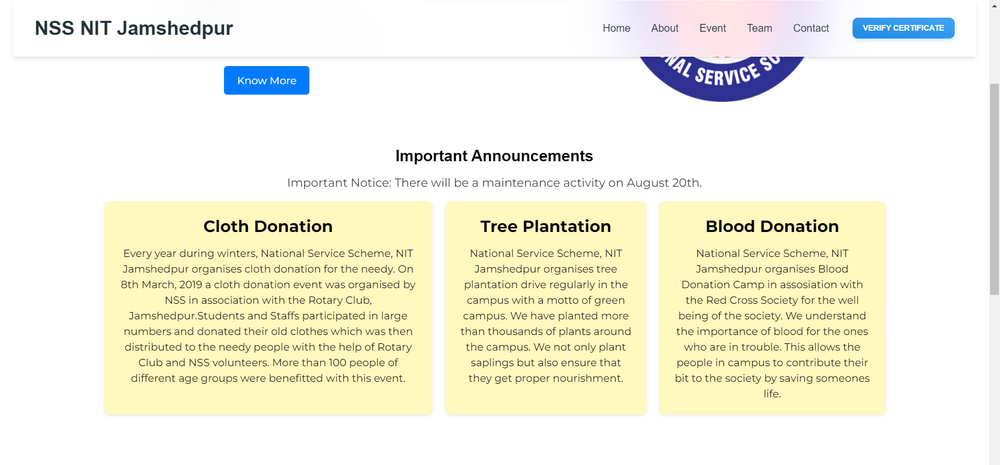

# Steps to set up in local environment

### Step 1
Clone the repository using Github Desktop or git commands from terminal

### Step 2
After cloning open VS Code and use these commands by opening terminal ( Ctrl + backtick)

npm install

After installation run this:
npm start

The website will open in http://localhost:3000/

# Home Page Done

## End of the documentation
